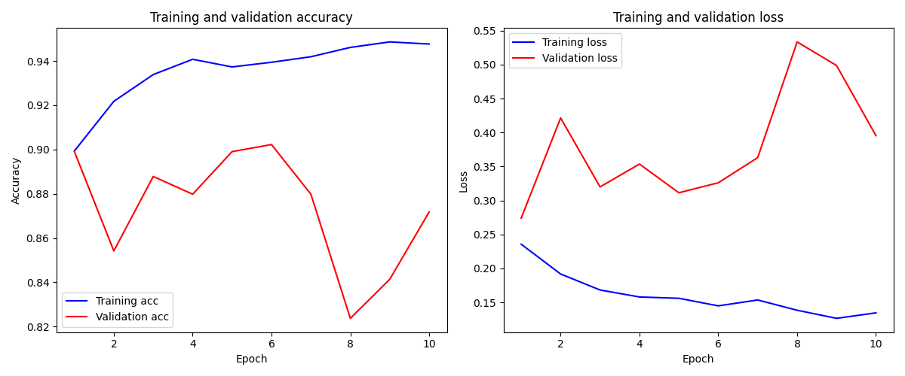
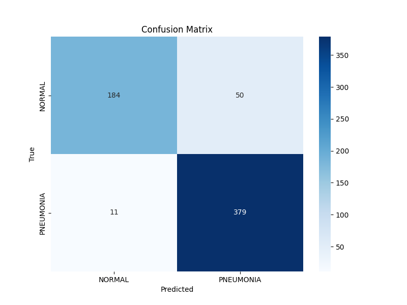

# PneumoScan: Phát Hiện Viêm Phổi Từ Ảnh X-Quang Bằng Deep Learning

 

## 1. Tổng Quan Dự Án
Dự án này ứng dụng Deep Learning, cụ thể là Mạng Neural Tích Chập (Convolutional Neural Networks - CNNs), để phát hiện bệnh Viêm phổi từ các ảnh chụp X-Quang lồng ngực. Chúng tôi sử dụng kỹ thuật **Transfer Learning** với kiến trúc **ResNet18** (đã được huấn luyện trước trên tập ImageNet) để đạt độ chính xác cao ngay cả với nguồn tài nguyên tính toán hạn chế.

Bài toán được định nghĩa dưới dạng phân loại nhị phân (Binary Classification):
- **NORMAL**: Phổi khỏe mạnh.
- **PNEUMONIA**: Phổi bị nhiễm viêm phổi.

Dự án này minh họa quy trình học máy đầu-cuối (end-to-end Machine Learning pipeline):
1.  **Xử lý Dữ liệu**: Tải, tiền xử lý và tăng cường dữ liệu ảnh y tế.
2.  **Huấn luyện Mô hình**: Fine-tuning mô hình ResNet18 sử dụng PyTorch.
3.  **Đánh giá**: Kiểm thử nghiêm ngặt với các chỉ số Accuracy, Precision, Recall, F1-Score và Confusion Matrix.
4.  **Dự đoán (Inference)**: Script và Web App để dự đoán trên ảnh mới.

## 2. Dữ Liệu
Bộ dữ liệu được sử dụng là [Chest X-Ray Images (Pneumonia)](https://www.kaggle.com/paultimothymooney/chest-xray-pneumonia) từ Kaggle.
- **Tổng số ảnh**: ~5,800 ảnh định dạng JPEG.
- **Phân loại**: Normal (Bình thường), Pneumonia (Viêm phổi).
- **Chia tập dữ liệu**: Dữ liệu được chia thành 3 thư mục (train, val, test). Chúng tôi sử dụng tập 'test' của Kaggle làm tập Validation trong quá trình huấn luyện để đánh giá khách quan.

### Cấu Trúc Thư Mục
Dự án được tổ chức như sau:
```text
PneumoScan/
├── data/
│   └── raw/
│       ├── train/          # Dữ liệu huấn luyện
│       │   ├── NORMAL/
│       │   └── PNEUMONIA/
│       └── val/            # Dữ liệu kiểm thử (Validation)
│           ├── NORMAL/
│           └── PNEUMONIA/
├── notebooks/              # Jupyter Notebooks phân tích dữ liệu (EDA)
├── outputs/                # Nơi lưu model đã train và biểu đồ
├── src/
│   ├── data/               # Scripts xử lý dữ liệu
│   ├── models/             # Định nghĩa mô hình (ResNet18)
│   ├── train.py            # Script huấn luyện chính
│   ├── evaluate.py         # Script đánh giá mô hình
│   ├── predict.py          # Script dự đoán 1 ảnh
│   └── app.py              # Web App (Streamlit)
├── requirements.txt        # Các thư viện cần thiết
└── README.md
```

## 3. Cài Đặt
1.  **Clone repository về máy**:
    ```bash
    git clone https://github.com/AnhNQ08/PneumoScan.git
    cd PneumoScan
    ```

2.  **Cài đặt các thư viện phụ thuộc**:
    Khuyên dùng môi trường ảo (Virtual Environment) như Conda hoặc venv.
    ```bash
    pip install -r requirements.txt
    ```

## 4. Hướng Dẫn Sử Dụng

### 4.1 Script Tải Dữ Liệu Tự Động
Chúng tôi đã tích hợp sẵn script để tải và sắp xếp dữ liệu từ Kaggle (yêu cầu file `kaggle.json` API key):
```bash
python src/download_data.py
```
*(Nếu không dùng script, bạn có thể tải thủ công từ Kaggle và sắp xếp vào `data/raw` như cấu trúc ở mục 2)*

### 4.2 Huấn Luyện (Training)
Để bắt đầu train model, chạy lệnh sau:
```bash
python src/train.py --epochs 10 --batch_size 32
```
- **Tính năng**: Tự động lưu model tốt nhất (Best Model) dựa trên độ chính xác tập Validation vào `outputs/pneumonia_model.pth`.
- **Logging**: Hiển thị Loss và Accuracy theo từng epoch.

### 4.3 Đánh Giá (Evaluation)
Để đánh giá model đã train trên tập Validation và tạo **Báo cáo phân loại** & **Confusion Matrix**:
```bash
python src/evaluate.py --data_dir data/raw --model_path outputs/pneumonia_model.pth
```
Biểu đồ Confusion Matrix sẽ được lưu tại `outputs/confusion_matrix.png`.

### 4.4 Dự Đoán (Inference)
Để dự đoán kết quả cho một hình ảnh X-Quang bất kỳ:
```bash
python src/predict.py --image_path path/to/your/image.jpeg
```
**Ví dụ kết quả**:
```text
Prediction: PNEUMONIA
Confidence: 98.45%
```

### 4.5 Ứng Dụng Web (Demo)
Chạy Web App đơn giản để upload ảnh và kiểm tra ngay trên trình duyệt:
```bash
streamlit run src/app.py
```
Trình duyệt sẽ tự mở địa chỉ (thường là `http://localhost:8501`).

## 5. Kết Quả
Dưới đây là kết quả thực nghiệm sau khi huấn luyện 10 epochs:

**Các chỉ số chính:**
- **Accuracy (Độ chính xác)**: ~90%
- **F1-Score (Pneumonia)**: 0.93 (Khả năng phát hiện viêm phổi rất tốt)
- **F1-Score (Normal)**: 0.86

**Biểu đồ huấn luyện & Confusion Matrix:**

<p float="left">
  
   
</p>


## 6. Công Nghệ Sử Dụng
- **Ngôn ngữ**: Python 3.8+
- **Deep Learning Framework**: PyTorch
- **Web App**: Streamlit
- **Thư viện hỗ trợ**: Torchvision, Scikit-learn, Pandas, NumPy, Matplotlib, Seaborn, PIL.

## 7. Hướng Phát Triển
- Tích hợp **Grad-CAM** để trực quan hóa vùng phổi mà model "nhìn" thấy bệnh.
- Thử nghiệm với các kiến trúc sâu hơn như ResNet50, DenseNet121 hoặc Vision Transformers (ViT).
- Deploy mô hình lên Cloud (AWS/GCP) hoặc đóng gói thành Docker container.

## 8. Tác Giả
**AnhNQ08**
- [Giới thiệu GitHub](https://github.com/AnhNQ08)
